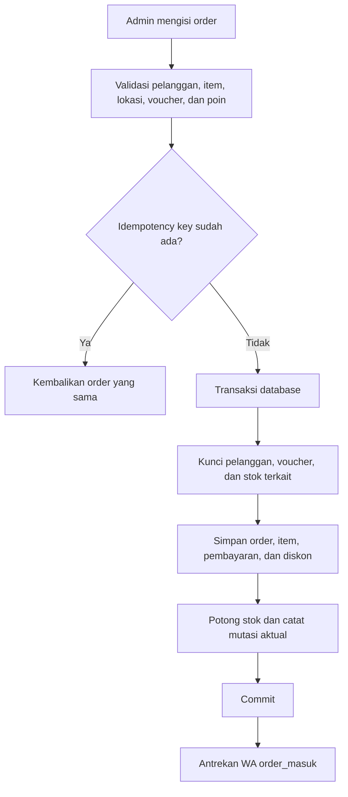
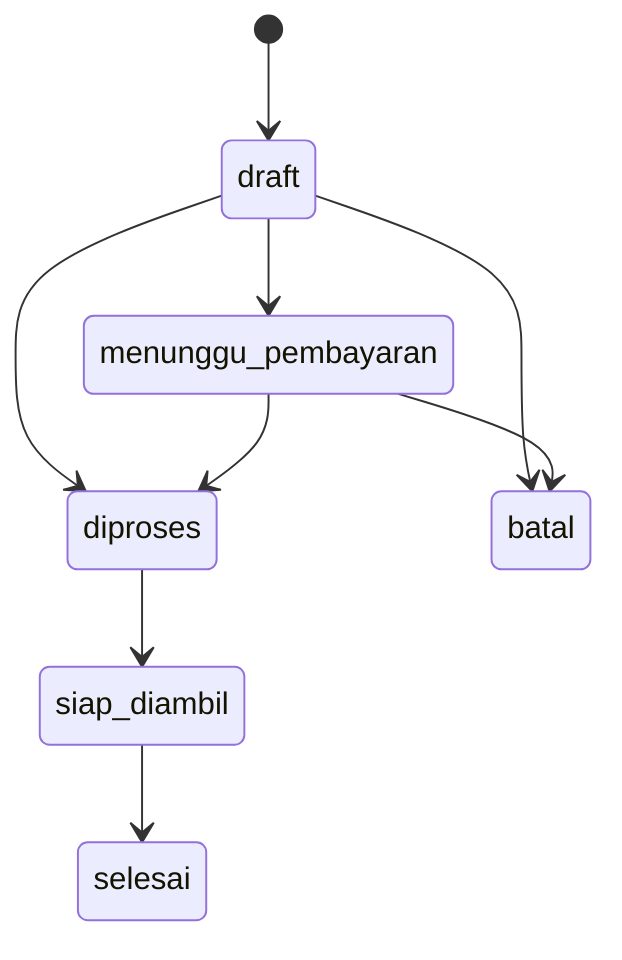
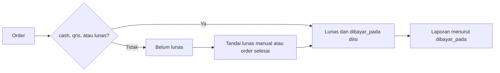
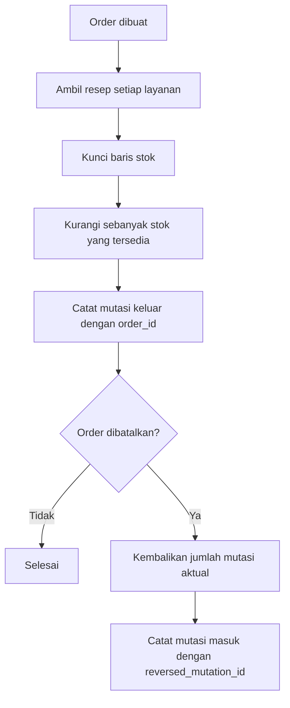

# Business Flow - Step Shine Works

Dokumen ini menggambarkan alur yang dijalankan aplikasi saat ini.

## 1. Order

Pembuatan order bersifat atomik. Kegagalan pada salah satu penulisan akan
melakukan rollback seluruh transaksi. `idempotency_key` mencegah order ganda
ketika form dikirim ulang.

Status hanya dapat bergerak maju:

- Masuk `diproses`: antrekan WA `mulai_dicuci`.
- Masuk `siap_diambil`: set waktu siap dan antrekan WA `order_selesai`.
- Masuk `selesai`: pembayaran yang belum lunas ditandai lunas dan poin diberikan satu kali.
- Masuk `batal`: stok, poin yang ditukar, dan pemakaian voucher dikembalikan satu kali.
- Order `siap_diambil`, `selesai`, atau `batal` tidak dapat diedit.

## 2. Pembayaran dan Laporan

Hanya pembayaran berstatus `selesai` yang masuk laporan. Order batal
dikecualikan. Net sales membagi diskon voucher dan diskon poin secara
proporsional ke setiap item agar rekap layanan dan lokasi tetap konsisten.

## 3. Harga, Voucher, dan Poin

Harga item memakai urutan berikut:

1. Override harga layanan pada lokasi.
2. Harga standar layanan ditambah biaya lokasi bila lokasi memakai harga custom.
3. Harga standar layanan.

Voucher divalidasi berdasarkan status aktif, periode berlaku, minimum transaksi,
dan batas pemakaian. Penukaran poin bernilai Rp100 per poin dan tidak boleh
melebihi saldo maupun nilai transaksi setelah voucher.

Poin order dihitung `floor(total pembayaran / 10.000)` dan baru diberikan saat
status `selesai`. Setiap award atau refund memiliki idempotency key agar retry
tidak menggandakan saldo.

## 4. Stok

Jika stok tidak cukup, sistem memotong jumlah yang tersedia dan menampilkan
peringatan kepada operator. Pembatalan hanya mengembalikan jumlah yang benar-benar
pernah dipotong, bukan menghitung ulang resep.

## 5. WhatsApp

Pesan transaksional dikirim melalui job queue dan Twilio WhatsApp API:

| Pemicu | Template |
| --- | --- |
| Order dibuat | `order_masuk` |
| Status menjadi `diproses` | `mulai_dicuci` |
| Status menjadi `siap_diambil` | `order_selesai` |
| Operator mengirim invoice | `invoice` |

Nomor dinormalisasi ke format internasional Indonesia. Kredensial Twilio yang
tidak lengkap membuat pengiriman dilewati dan dicatat sebagai warning. Kegagalan
provider di-retry maksimal tiga kali dengan jeda 60 detik.

Pesan `siap_diambil` hanya menampilkan estimasi poin. Saldo poin bertambah setelah
order menjadi `selesai`.

## 6. Tracking dan Review Publik

Setiap order memiliki token publik acak. Pelanggan dapat melihat status tanpa
login. Form review baru tersedia untuk order `selesai`; satu order hanya dapat
memiliki satu review dengan rating 1-5 dan ulasan maksimal 500 karakter.

---

Sumber implementasi utama:
`app/Http/Controllers/OrderController.php`,
`app/Models/Order.php`,
`app/Services/StockAutomationService.php`,
`app/Services/WhatsappService.php`, dan
`app/Jobs/KirimWaJob.php`.

Terakhir diperbarui: 29 Juli 2026.
