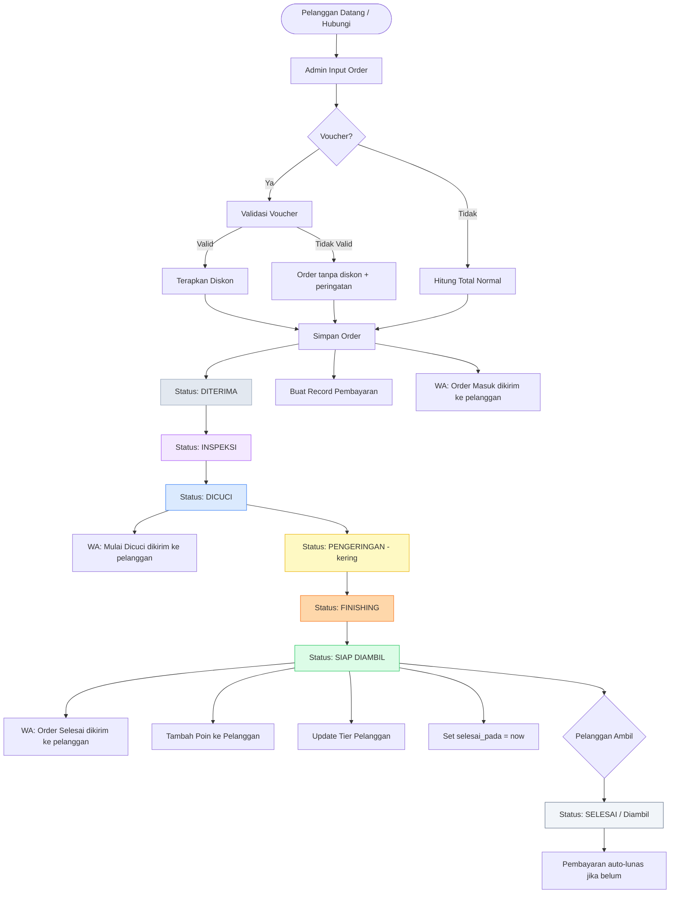
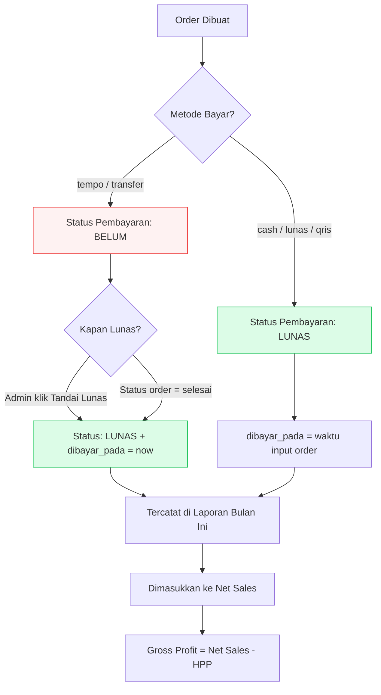
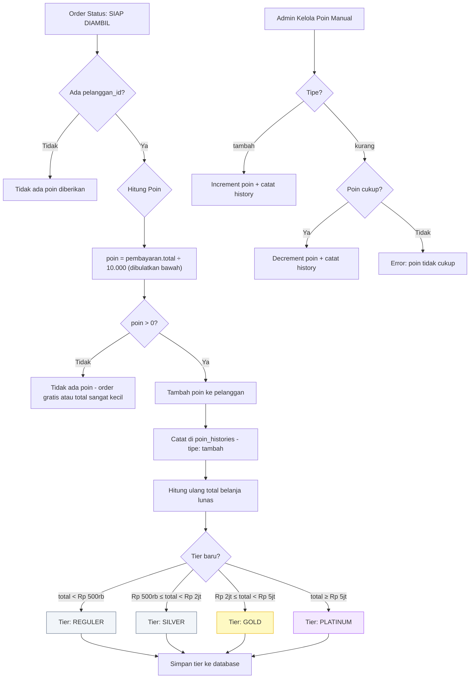
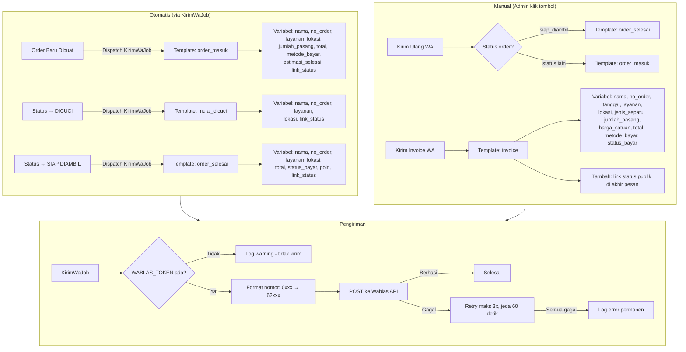
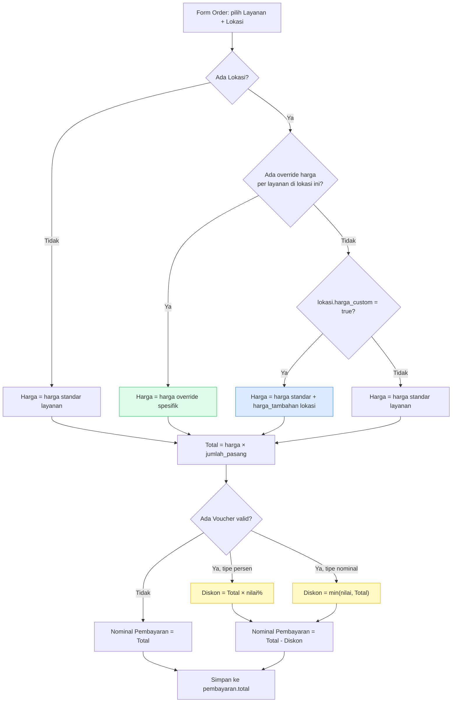
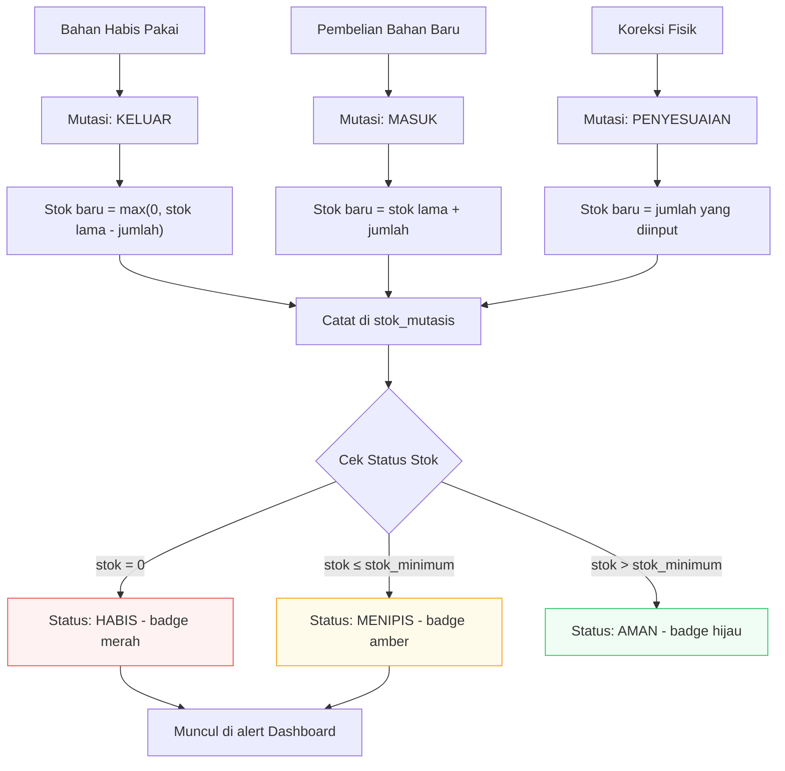
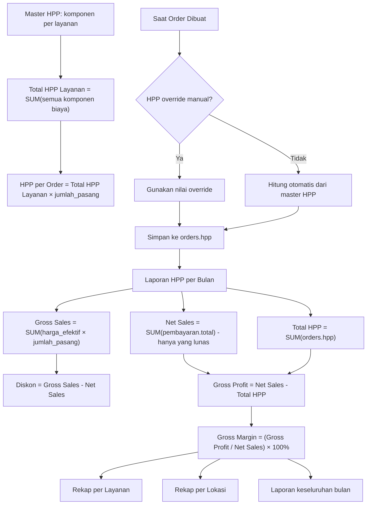

# Business Flow — Step Shine Works

Diagram alur bisnis sistem manajemen shoe care Step Shine Works.

---

## 1. Alur Lengkap Order (Order Lifecycle)



---

## 2. Alur Pembayaran (Payment Flow)



---

## 3. Alur Loyalitas Pelanggan (Poin & Tier)



---

## 4. Trigger Notifikasi WhatsApp



---

## 5. Alur Harga Efektif Order



---

## 6. Alur Manajemen Stok



---

## 7. Alur Kalkulasi HPP dan Laporan Profit



---

## 8. Alur Verifikasi dan Pengiriman Review Pelanggan

```mermaid
flowchart TD
    A[Status Order → SIAP DIAMBIL] --> B[WA order_selesai dikirim]
    B --> C["Pesan berisi link: /status/{token_publik}"]

    C --> D[Pelanggan buka link di browser]
    D --> E{Order sudah selesai?}
    E -->|Tidak| F[Tampilkan status order saja - tanpa form review]
    E -->|Ya| G[Tampilkan form rating 1-5 bintang + ulasan]

    G --> H{Review sudah ada?}
    H -->|Ya| I[Tampilkan pesan: review sudah diberikan]
    H -->|Tidak| J[Pelanggan isi rating dan ulasan]

    J --> K[Submit POST /orders/{token}/review]
    K --> L[Validasi: rating 1-5, ulasan max 500 karakter]
    L --> M[Simpan ke tabel reviews]
    M --> N[Pesan: Terima kasih atas ulasannya!]

    O[Admin/Owner buka /reviews] --> P[Lihat semua review terbaru]
    P --> Q[Filter, rating, ulasan per pelanggan]

    style E fill:#f1f5f9,stroke:#64748b
    style H fill:#f1f5f9,stroke:#64748b
```

---

*Semua diagram berdasarkan kode aktual di `app/Http/Controllers/`, `app/Models/`, `app/Services/WhatsappService.php`, dan `app/Jobs/KirimWaJob.php`.*

*Terakhir diperbarui: 3 Juli 2026*
